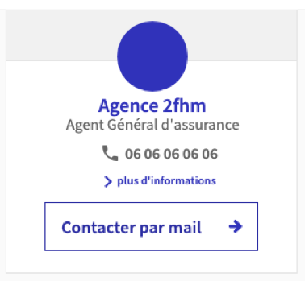
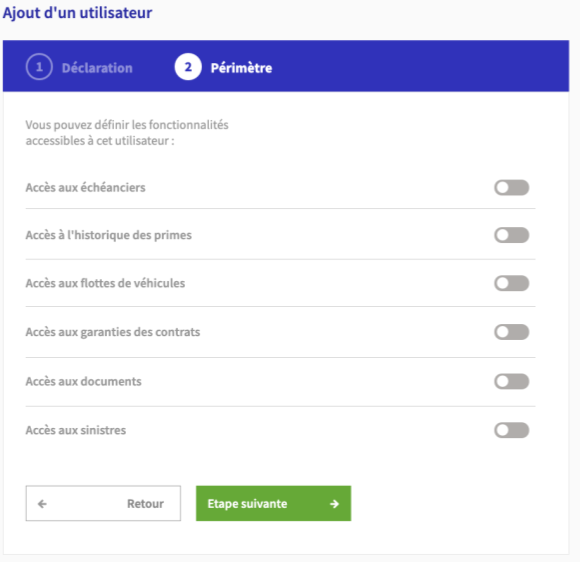

# Dojo intégration front

## Dojo 1 : from scratch

* Sans toolkit
* Sans less ni sass
* Un fichier HTML
* Lier un fichier CSS
* Nommage de classe
  - [https://speakerdeck.com/johnmeunier/developer-improve-your-dom-structure-with-bem](https://speakerdeck.com/johnmeunier/developer-improve-your-dom-structure-with-bem)
* Variable CSS
  - [https://developer.mozilla.org/fr/docs/Web/CSS/Using_CSS_custom_properties](https://developer.mozilla.org/fr/docs/Web/CSS/Using_CSS_custom_properties)
* Taille 
  - PX / % ?
  - EM / REM
    - Pour les typos
  	- Ratio d'une taille de police
  	  - EM : celle du parent
  		- REM : La taille root
  	- [https://zellwk.com/blog/rem-vs-em/](https://zellwk.com/blog/rem-vs-em/)
* Bold
  - Bold
  - Bolder
  - 300 / 500
  - [https://twitter.com/JoshWComeau/status/1351550796433944580?s=20](https://twitter.com/JoshWComeau/status/1351550796433944580?s=20)
* Affichage d'icone
  - Icone bootstrap
  - Font icone
  - Image ? 
  - SVG ?
  - [https://fontawesome.com/v4.7.0/examples/](https://fontawesome.com/v4.7.0/examples/)
* Animation sur le bouton
  - On parle souvent d'animation mais on utilise des transition la plupart du temps
  - [https://developer.mozilla.org/en-US/docs/Web/CSS/CSS_Transitions/Using_CSS_transitions](https://developer.mozilla.org/en-US/docs/Web/CSS/CSS_Transitions/Using_CSS_transitions)
  - Pour des cas complexes : animation
  - [https://developer.mozilla.org/fr/docs/Web/CSS/Animations_CSS/Utiliser_les_animations_CSS](https://developer.mozilla.org/fr/docs/Web/CSS/Animations_CSS/Utiliser_les_animations_CSS)
* Display flex
  - [https://developer.mozilla.org/fr/docs/Web/CSS/CSS_Flexible_Box_Layout/Concepts_de_base_flexbox](https://developer.mozilla.org/fr/docs/Web/CSS/CSS_Flexible_Box_Layout/Concepts_de_base_flexbox)
* Mobile first 
* Responsive
  - Si grand écran afficher la photo à gauche, les infos au milieu, le bouton en dessous
  - Si petit écran afficher comme sur l'image, tout l'un en dessous de l'autre
  - [https://developer.mozilla.org/en-US/docs/Web/CSS/Media_Queries/Using_media_queries](https://developer.mozilla.org/en-US/docs/Web/CSS/Media_Queries/Using_media_queries)

## Dojo 2 : PEMA x surcharge toolkit

### Composant toolkit utiles
- [Checkbox Switch](https://axaguildev.github.io/react-toolkit/latest/storybook/?path=/story/form-input-checkbox--checkboxitem-toggle) 
- [Stepper](https://axaguildev.github.io/react-toolkit/latest/storybook/?path=/story/form-steps--old-design-steps)
- [Button with icon](https://axaguildev.github.io/react-toolkit/latest/storybook/?path=/story/button--button-with-left-icon)

### Contenu de la formation
* La maquette
  - Que faites vous quand on vous donne une maquette ? 
  - Lecture initiale d'une maquette
  - Découpe d'une maquette
* Récupération des composants du toolkit
  - https://axaguildev.github.io/react-toolkit/latest/design/index.html#/
* Comment surcharger un composant du toolkit
* Stepper
  - Fond
  - Espacement
  - Taille
  - Fond rond
* Input
  - Séparation hr
  - Label à gauche, input à droite
* Boutons
  - Re design
* Alignement